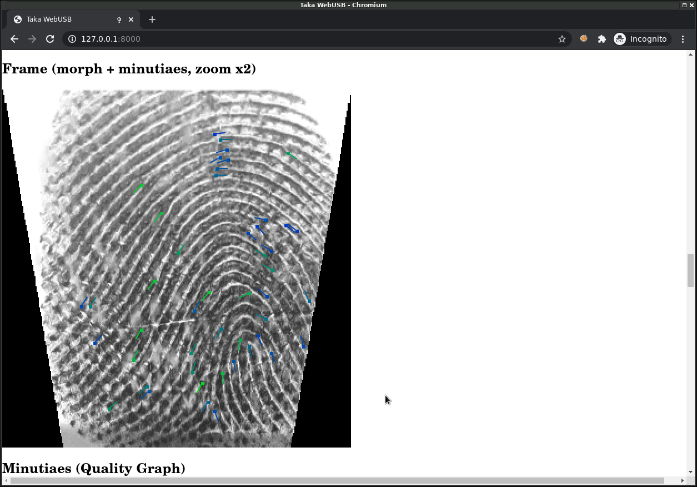

API
===

-----

USB
---

Le connecteur USB situé à l'arrière du boitier Taka permet une connexion
à un PC.

.. image:: _static/image/usage/usb.png

-----

Exemple WebUSB
--------------

Un exemple d'utilisation de cette API est fournie dans une application
WebUSB utilisable depuis un navigateur Web (Chrome).
Cette application implémente l'ensemble des fonctionnalités fournies
par l'API et peut donc servir de référence.

Installation
^^^^^^^^^^^^

Voir le README https://github.com/lambdaconcept/taka/tree/master/utils/takaweb

::

    (Linux) Install Udev rules
    ==========================

    Write the rule in:

    /etc/udev/rules.d/52-taka.rules
    -------------------------------
    ACTION=="add", SUBSYSTEM=="usb", ATTRS{idVendor}=="ffff", ATTRS{idProduct}=="1234", MODE="0664", GROUP="plugdev"
    -------------------------------

    Reload the rules:

    # udevadm control --reload-rules && udevadm trigger

    (Windows) Install WinUSB driver
    ===============================

    https://zadig.akeo.ie/

    Assign "WinUSB" driver to the device.

    Run the HTTP server for testing
    ===============================

    $ python3 -m http.server

    In a Web browser (Chrome), connect to:

    http://127.0.0.1:8000/

Connection
^^^^^^^^^^

.. image:: _static/image/webusb/connect.png
    :width: 600px

Lecture des fichiers ARCH
^^^^^^^^^^^^^^^^^^^^^^^^^

Lorsqu'une carte d'identité provisionnée avec l'application ARCH est insérée
dans le boitier Taka, le contenu des fichiers ARCH peut être lu via l'API:

Lecture des fichiers ICAO
^^^^^^^^^^^^^^^^^^^^^^^^^

Lorsqu'une carte d'identité provisionnée avec l'application ICAO (eTravel)
est insérée dans le boitier Taka, le contenu des fichiers ICAO DG1 à DG16
peut être lu via l'API:

Lecture des journaux
^^^^^^^^^^^^^^^^^^^^

A tout moment le contenu des logs stockés dans le boitier Taka (sur carte SD)
peut être lu via l'API. La requête doit préciser la date voulue (1 jour à
la fois). Voir la section :doc:`logs` pour le descriptif du format journal.

.. image:: _static/image/webusb/logs.png
    :width: 600px

Lecture d'empreinte
^^^^^^^^^^^^^^^^^^^

L'empreinte digitale capturée par la caméra optique est accessible
par l'API. Seule la dernière image capturée est disponible, une nouvelle
tentative écrasant l'image précédente.

3 images sont récupérables:

* **Frame Raw:** image reçue du capteur sans aucun traitement
* **Frame Morph:** image après traitements de correction de déformations et d'aberration
* **Minutiaes:** empreinte + représentation des minutiaes trouvés

-----

Détails du protocole API USB
----------------------------

Le protocole est implémenté sous la forme de commandes/réponses.
Les commandes sont toujours émises par le host (PC), auxquelles le device
(Taka) répond. Taka n'émet pas de messages USB sans être sollicité au
préalable par une commande reçue du host.

**Implémentation de référence:** (Javascript) voir https://github.com/lambdaconcept/taka/blob/master/utils/takaweb/index.js

Les commandes respectent le format suivant:

* **1er octet** (obligatoire): numéro de la commande
* **octet suivants** (optionnels): paramètres de la commande

Liste des commandes:

.. csv-table::
    :header: Nom,       Numéro,     Paramètres

    Get Version,        0x00,
    Get ARCH,           0x01,       1 octet
    Get ICAO,           0x02,       1 octet
    Get Logs,           0x03,       8 octets
    Get Frame Raw,      0x04,
    Get Frame Morph,    0x05,
    Get Minutiaes,      0x06,

Get Version
^^^^^^^^^^^
    * **Description:** Lit la version actuelle du firmware programmé sur le boitier Taka.
    * **Numéro:** 0x00
    * **Paramètres:** Aucun
    * **Réponse:** La version sous forme de chaine de caractères (NULL terminated). Exemple: "v.0.96"

Get ARCH
^^^^^^^^
    * **Description:** Lit un fichier ARCH présent sur la carte d'identité. Le numéro du conteneur à lire est indiqué par un paramètre. Cette commande renvoie un paquet USB de taille vide (ZLP) lorsqu'aucune carte n'est insérée ou que le conteneur n'existe pas.
    * **Numéro:** 0x01
    * **Paramètres:** 1 octet, le numéro du fichier ARCH à lire (0x00-0x03)
    * **Réponse:** Renvoie le contenu du fichier ARCH demandé

Get ICAO
^^^^^^^^
    * **Description:** Lit un fichier ICAO présent sur la carte d'identité. Le numéro du conteneur à lire est indiqué par un paramètre. Cette commande renvoie un paquet USB de taille vide (ZLP) lorsqu'aucune carte n'est insérée ou que le conteneur n'existe pas.
    * **Numéro:** 0x02
    * **Paramètres:** 1 octet, le numéro du fichier DG à lire (0x00-0x0f)
    * **Réponse:** Renvoie le contenu du fichier ICAO demandé

Get Logs
^^^^^^^^
    * **Description:** Récupère les évènements ayant eu lieu le jour passé en paramètre.
    * **Numéro:** 0x03
    * **Paramètres:** 8 caractères ASCII au format "YYYYMMDD", correspondant à la date du jour voulu
    * **Réponse:** Le contenu du fichier journal pour le jour demandé. Voir la section :doc:`logs` pour le descriptif du format journal.

Get Frame Raw
^^^^^^^^^^^^^
    * **Description:** Récupère la dernière image de l'empreinte capturée par la caméra. Il s'agit de l'image brute reçue du capteur sans aucun traitement.
    * **Numéro:** 0x04
    * **Paramètres:** Aucun
    * **Réponse:** L'image au format binaire (framebuffer 8bit grayscale, 640x380 px)

Get Frame Morph
^^^^^^^^^^^^^^^
    * **Description:** Récupère la dernière image de l'empreinte après les traitements de correction de déformations et d'aberration.
    * **Numéro:** 0x05
    * **Paramètres:** Aucun
    * **Réponse:** L'image au format binaire (framebuffer 8bit grayscale, 314x322 px)

Get Minutiaes
^^^^^^^^^^^^^
    * **Description:** Récupère l'ensemble des minutiaes extraits à partir de la dernière image capturée par la caméra. Cette commande renvoie un paquet USB de taille vide (ZLP) lorsque l'extraction à échoué (image de mauvaise qualité, doigt non présent, etc.)
    * **Numéro:** 0x06
    * **Paramètres:** Aucun
    * **Réponse:** Renvoie les minutiaes au format ISO/IEC 19794-2:2005 (Record Format, FMR)
