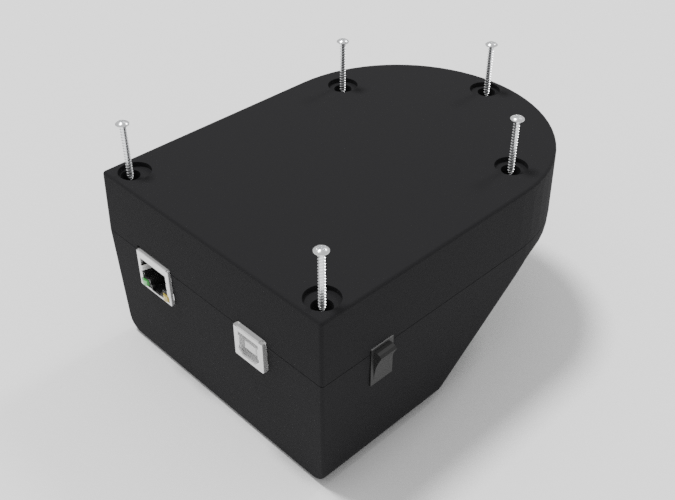
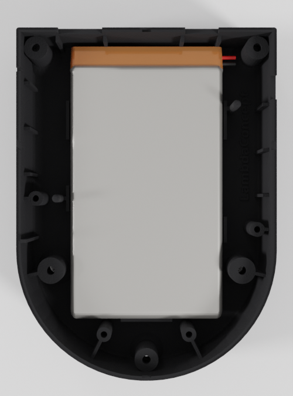
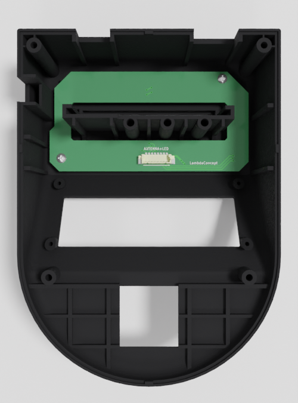
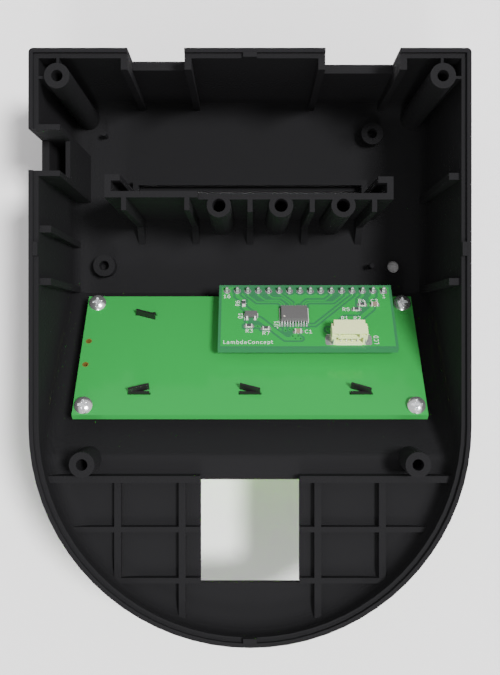

Boîtier
=======

-----

Démontage
---------

Ouvrir le boitier en retirant les patins autocollants en caoutchouc puis
en dévissant les 5 vis longues.

L'appareil est constitué d'une carte mère et de 4 cartes modules reliées
par des fils, et d'une batterie.

* :ref:`refCaseMotherboard`
* :ref:`refCaseCamera`
* :ref:`refCaseLED`
* :ref:`refCaseSmartcard`
* :ref:`refCaseScreen`

-----

.. _refCaseBattery:

Batterie
--------

L'emplacement batterie est situé sous la carte mère. Les fils de la batterie
doivent remonter en passant dans l'encoche proche de l'interrupteur,
puis être connectés à ``CN9: BATTERY`` de la carte mère.

-----

.. _refCaseSD:
.. _refCaseMotherboard:

Carte mère
----------

La carte mère est vissée dans la partie inférieure du boitier par 2 vis
(en bas).

La carte mère doit être reliés aux autres modules par les groupes de fils
(4 ou 8 pins) et par la nappe flex.

* **Connecteur batterie:** ``CN9: BATTERY``

* **Connecteur nappe flexible:** ``CN6: CAMERA`` (Flex)
* **Connecteur touch:** ``CN10: TOUCH`` (4 pins)

* **Connecteur LED:** ``CN4: LED ANTENNA`` (8 pins)
* **Connecteur carte à puce:** ``CN3: SMARTCARD`` (8 pins)
* **Connecteur écran:** ``CN7: LCD`` (4 pins)

* **Connecteur carte SD:** ``CN2: MICRO SD`` (1 GB)

.. image:: _static/image/casing/motherboard.png
    :width: 400px

-----

.. _refCaseCamera:
.. _refCaseTouch:

Module caméra/touch
-------------------

Ce module contient 2 capteurs:

* Caméra optique pour capturer l'empreinte digitale.
* Capteur tactile (touch) pour détecter la présence du doigt.

* **Connecteur nappe flexible:** ``CN6: CAMERA`` (Flex)
* **Connecteur carte mère:** ``CN10: TOUCH`` (4 pins)

Il est vissé dans la partie inférieure du boitier par 2 vis (en bas).

.. image:: _static/image/casing/cameratouch.png
    :width: 400px

-----

.. _refCaseLED:
.. _refCaseAntenna:

Module LED/antenne
------------------

Ce module se visse sur la partie supérieure du boitier (2 vis).

* **Connecteur carte mère:** ``CN4: LED ANTENNA`` (8 pins)

-----

.. _refCaseSmartcard:

Module carte à puce
-------------------

Ce module se glisse et se visse sur la partie supérieure du boitier
(2 ou 3 vis + rondelles).

* **Connecteur carte mère:** ``CN3: SMARTCARD`` (8 pins)

.. image:: _static/image/casing/smartcard.png
    :width: 400px

-----

.. _refCaseScreen:

Module écran
------------

Ce module doit être vissé dans la partie supérieure du boitier
(4 petites vis).

* **Connecteur carte mère:** ``CN7: LCD`` (4 pins)

