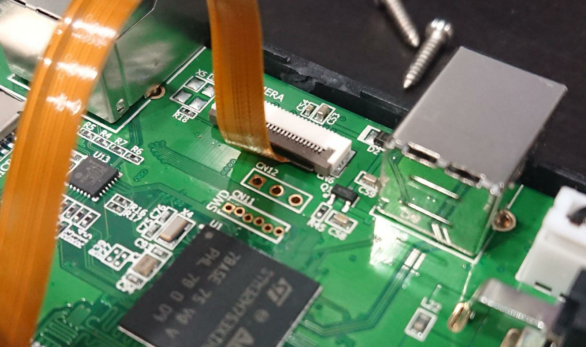
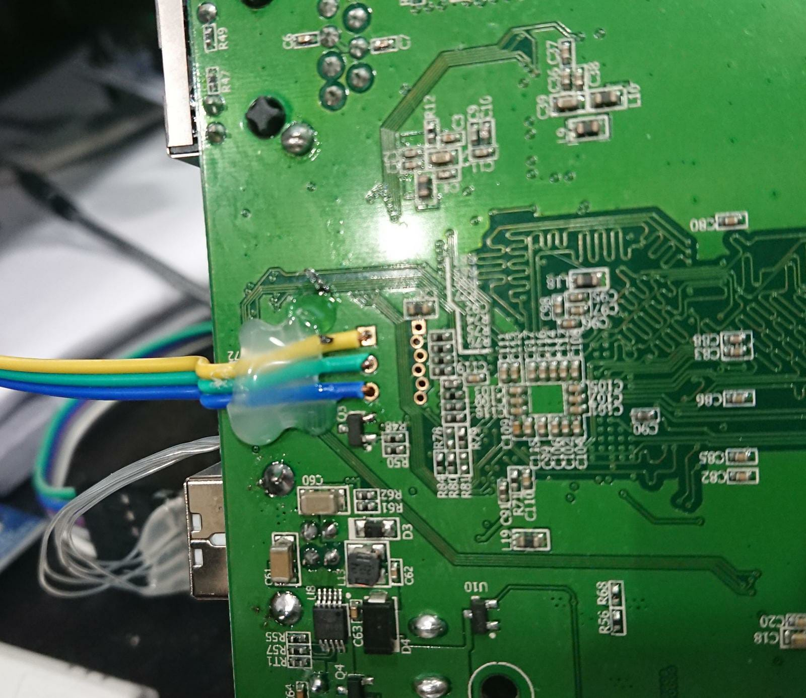
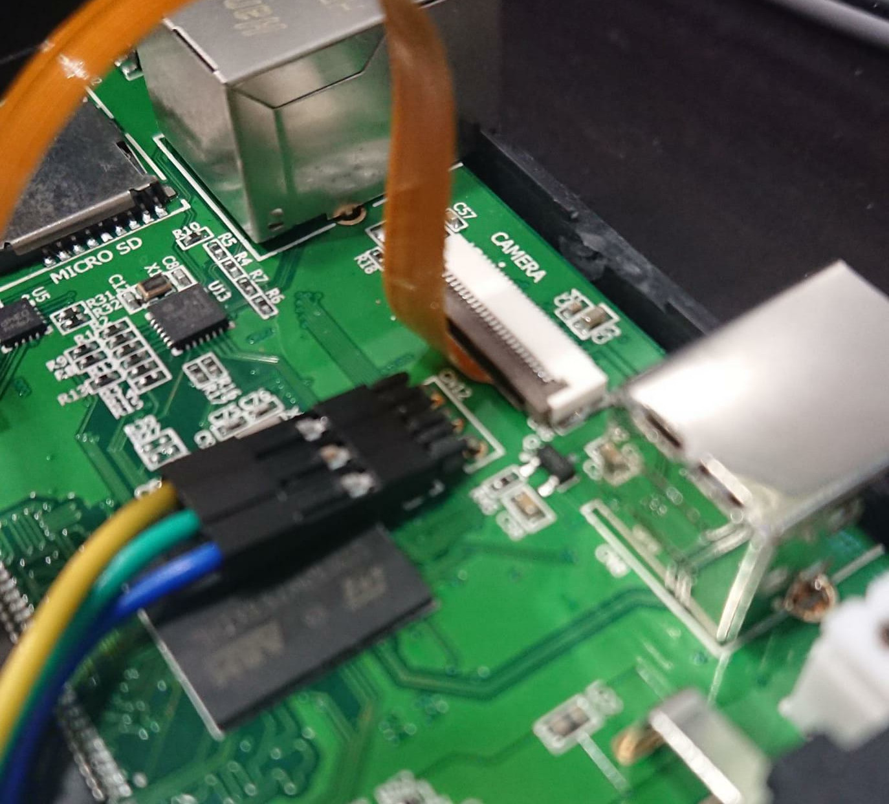
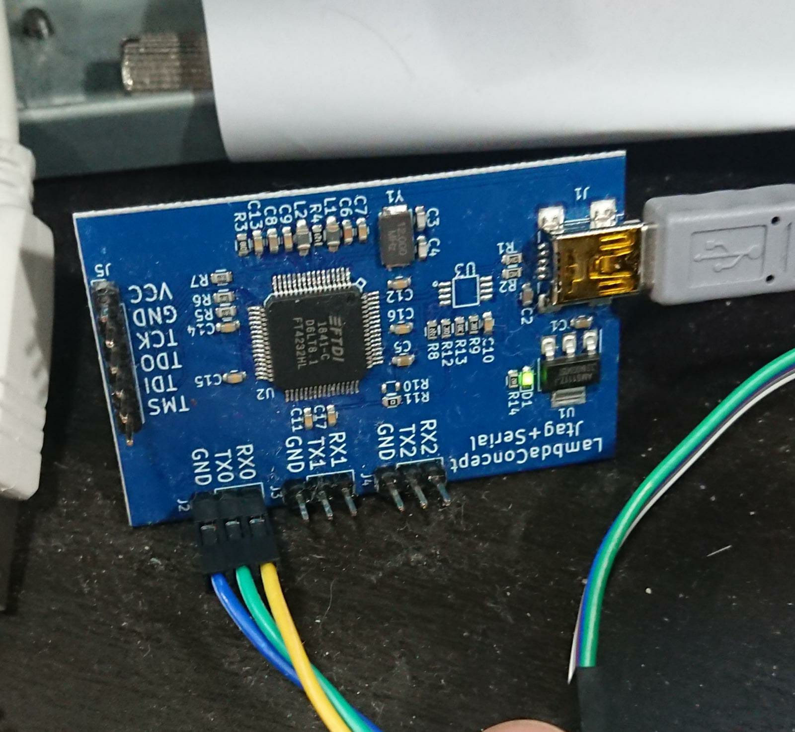

Développement
=============

Le firmware de Taka est basé sur le système d'exploitation temps réel
NuttX.

Console de debug
----------------

La console de debug de Taka est accessible par le connecteur 3 pins CN12
situé sur la carte mère. Il faut y connecter un câble de type debug UART.
(Par exemple le câble LambdaConcept Jtag+Serial)

* Pin 1 (Carré): Taka TX
* Pin 2: Taka RX
* Pin 3: GND

**Exemples de branchement**

* En soudant les fils au dos de la carte mère:

* Ou en faisant contact avec des pins coudés:

**Câble USB UART**

* RX0 <--- Taka TX
* TX0 ---> Taka RX
* GND <--> Taka GND

Minicom
^^^^^^^

Côté PC, le câble de debug UART est vu en tant que périphérique TTY USB.
Si les fils ont été branchés sur le canal TX0/RX0, le périphérique
côté PC sera en principe /dev/ttyUSB1.

On peut vérifier en laissant tourner dmesg tout en branchant le câble de debug::

    # dmesg -w
    [47587.720861] usb 1-2.4.2: new high-speed USB device number 29 using xhci_hcd
    [47587.861696] usb 1-2.4.2: New USB device found, idVendor=0403, idProduct=6011, bcdDevice= 8.00
    [47587.861703] usb 1-2.4.2: New USB device strings: Mfr=1, Product=2, SerialNumber=0
    [47587.861706] usb 1-2.4.2: Product: Quad RS232-HS
    [47587.861710] usb 1-2.4.2: Manufacturer: FTDI
    [47587.871543] ftdi_sio 1-2.4.2:1.0: FTDI USB Serial Device converter detected
    [47587.871600] usb 1-2.4.2: Detected FT4232H
    [47587.871790] usb 1-2.4.2: FTDI USB Serial Device converter now attached to ttyUSB0
    [47587.872008] ftdi_sio 1-2.4.2:1.1: FTDI USB Serial Device converter detected
    [47587.872056] usb 1-2.4.2: Detected FT4232H
    [47587.872249] usb 1-2.4.2: FTDI USB Serial Device converter now attached to ttyUSB1
    [47587.872452] ftdi_sio 1-2.4.2:1.2: FTDI USB Serial Device converter detected
    [47587.872495] usb 1-2.4.2: Detected FT4232H
    [47587.872663] usb 1-2.4.2: FTDI USB Serial Device converter now attached to ttyUSB2
    [47587.872908] ftdi_sio 1-2.4.2:1.3: FTDI USB Serial Device converter detected
    [47587.872968] usb 1-2.4.2: Detected FT4232H
    [47587.873122] usb 1-2.4.2: FTDI USB Serial Device converter now attached to ttyUSB3

Ici, on a:

* **ttyUSB0:** JTAG (Inutilisé ici)
* **ttyUSB1:** RX0/TX0 **<------**
* **ttyUSB2:** RX1/TX1
* **ttyUSB3:** RX2/TX2

On s'y connecte avec minicom::

    $ minicom -s -D /dev/ttyUSB1

    -> Serial port setup
       -> Hardware Flow Control : No

**Console nuttx**::

    Welcome to minicom 2.8

    OPTIONS: I18n
    Compiled on Jan  9 2021, 12:42:45.
    Port /dev/ttyUSB1, 19:17:31

    Press CTRL-A Z for help on special keys

    ADE
    taka [5:100]

    NuttShell (NSH) NuttX-9.0.0
    nsh>

Telnet
------

Le prompt NuttX est aussi accessible en Telnet (Pas besoin de câble de debug
mais plus complexe).

1. Brancher un câble Ethernet à Taka
2. Redémarrer Taka
3. Taka prend une adresse IP par DHCP

Pour trouver l'IP de Taka:

* Soit par l'interface du routeur DHCP
* Soit en scannant le réseau (TCP/23): sudo nmap -sS -T5 -n -p 23 192.168.0.0/24

::

    $ telnet 192.168.0.2

    NuttShell (NSH) NuttX-9.0.0
    nsh> ps
      PID PRI POLICY   TYPE    NPX STATE    EVENT     SIGMASK   STACK COMMAND
        0   0 FIFO     Kthread N-- Ready              00000000 000000 Idle Task
        1 224 FIFO     Kthread --- Waiting  Signal    00000000 002028 hpwork
        2 100 FIFO     Kthread --- Ready              00000000 002028 lpwork
        3 100 FIFO     Task    --- Waiting  Semaphore 00000000 002028 init
        4 100 FIFO     Task    --- Waiting  Semaphore 00000000 002004 Telnet daemon 0x38003790
        5 100 RR       Task    --- Waiting  Semaphore 00000000 131052 taka
        7 100 FIFO     Task    --- Waiting  Signal    00000000 002020 NTP daemon
        8 100 FIFO     Kthread --- Waiting  Semaphore 00000000 000996 telnet_io
        9 100 FIFO     Task    --- Running            00000000 002020 Telnet session

L'application Taka tourne en tâche de fond. Pour accéder au log de debug
il faut la terminer et la relancer manuellement::

    nsh> kill -9 5
    nsh> taka

Compilation
-----------

Voir les explications ici: https://github.com/lambdaconcept/taka

Une fois le firmware compilé, programmer Taka avec le nouveau binaire
comme expliqué dans la section :doc:`update`.

Architecture NuttX
------------------

NuttX est contenu dans 2 dossiers:

    * **nuttx:** contient le système d'exploitation, les drivers et la platforme.
    * **apps:** contient les applications

**Plateforme Taka:**

    https://github.com/lambdaconcept/taka-nuttx/tree/master/boards/arm/stm32h7/taka

**Application Taka:**

    https://github.com/lambdaconcept/taka-apps/tree/master/examples/taka

**Description des fichiers:**

Ce dossier contient le point d'entrée de l'application Taka ainsi que 
les librairies et sous fonctions.

**Boucle principale de l'application**::

    taka_main.c         <-- Application de production

    selftest_main.c     <-- Application test usine

**Fichiers relatifs à la carte à puce**::

    apdu.c
    smartcard.c         <--- Couches de communication avec la carte à puce

    arch.c              <--- Lecture des données ARCH

    icao.c              <--- Lecture des données ICAO
    icao_auth.c         <--- Authentification passive ICAO
    icao_decode.c       <--- Décodage TLV des containers ICAO

    libecc/             <--- Librarie cryptographique pour authentification passive
    libpkcs7            <--- Librarie de lecture de certificats PKCS#7

**Fichiers relatifs à la gestion des empreintes digitales**::

    cam.c               <--- Capture d'une image caméra
    frame.c             <--- Traitements de correction de déformations
    fingerjet/          <--- Librairie d'extraction des minutiaes
    minutiaes.c         <--- Validation de la qualité des minutiaes et conversion de format

**Suivi des opérations**::

    led.c               <--- Couleur des LEDs
    slcd.c              <--- Affichage sur l'écran LCD
    tone.c              <--- Son du buzzer

**Export des journaux**::

    logs.c

**API USB**::

    usb.c

**Fichiers système**::

    battery.c           <--- Niveau de charge de la batterie
    buttons.c
    datetime.c          <--- Date et heure UTC
    gpio.c
    network.c
    sdram.c
    taka.h              <--- Gestion des erreurs système

**Lecture sans contact NFC (Non implémenté)**::

    nfc.c
    libnfc/

Defines
-------

**Version de Taka:**

    * https://github.com/lambdaconcept/taka-apps/blob/master/examples/taka/taka.h#L6

**Activer les prints de debug:**

La plupart des fichiers ont un flags de debug qui permet d'avoir plus
d'informations sur la console en cas dysfonctionnement, par exemple:

    * https://github.com/lambdaconcept/taka-apps/blob/master/examples/taka/taka_main.c#L44
    * https://github.com/lambdaconcept/taka-apps/blob/master/examples/taka/arch.c#L14
    * https://github.com/lambdaconcept/taka-apps/blob/master/examples/taka/icao.c#L15

**Activer/Désactiver l'authentification passive:**

    * https://github.com/lambdaconcept/taka-apps/blob/master/examples/taka/icao.h#L9
