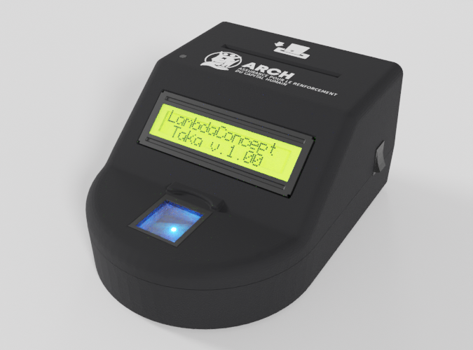

.. include common

Taka
====

**LECTEUR BIOMÉTRIQUE ARCH**

-----

Taka est un lecteur biométrique qui permet de réaliser l'authentification forte
d'une personne bénéficiaire ARCH (Assurance pour le Renforcement du Capital Humain),

A ce titre, le boitier Taka est pourvu:

* d'un lecteur de carte à puce permettant de communiquer avec une carte
  nationale d'identité biométrique,
* d'un lecteur d'empreinte digitale permettant de vérifier
  la bonne correspondance entre l'empreinte stockée dans la carte et le doigt
  de la personne bénéficiaire,
* d'un écran permettant de connaitre le résultat de l'authentification.
.. toctree::
    :hidden:
    :maxdepth: 2
    :caption: DOCUMENTATION

    Home <self>
    features
    usage
    api
    logs
    update
    troubleshooting
    casing
    development
