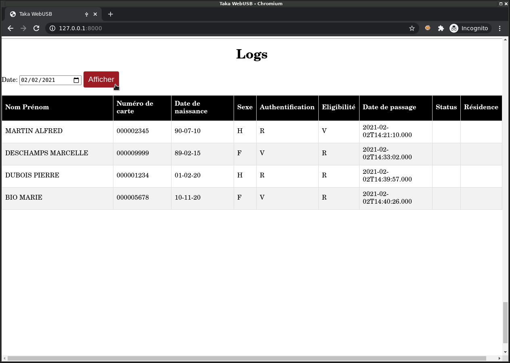

Journaux
========

-----

Chaque opération d'authentification d'un bénéficiaire est enregistrée
avec la date et l'heure de passage (UTC) dans un journal stocké dans une
mémoire de type carte micro SD, au format CSV.

La carte SD contient un système de fichier de type FAT32, organisé de la
manière suivante:

* Un dossier par année (2020, 2021, etc.)
* Pour chaque année, un fichier texte par jour (20210101.TXT, 20210102.TXT, etc.)

Exemple::

    nsh> ls LOGS/
    2020/
    2021/

    nsh> ls LOGS/2021/
    20210128.TXT
    20210129.TXT
    20210202.TXT

    nsh> cat LOGS/2021/20210202.TXT
    MARTIN<<ALFRED,000002345,90-07-10,H,R,V,2021-02-02T14:21:10.000,,
    DESCHAMPS<<MARCELLE,000009999,89-02-15,F,V,R,2021-02-02T14:33:02.000,,
    DUBOIS<<PIERRE,000001234,01-02-20,H,R,R,2021-02-02T14:39:57.000,,
    BIO<<MARIE,000005678,10-11-20,F,V,R,2021-02-02T14:40:26.000,,

-----

Format
------

Les logs sont stockés au format texte (CSV), et contiennent les colonnes suivantes:

* **Nom/Prénom:** Format NOM<<PRENOM (Comme sur le MRZ de la carte)
* **Numéro de carte:** Exemple: 000001234
* **Date de naissance:** Format yy-MM-dd. (L'année est stockée seulement sur 2 chiffres, le format long 4 chiffres n'étant pas provisionné dans les cartes fournies)
* **Sexe:** H = Homme, F = Femme
* **Authentification:** Résultat de la vérification d'empreinte (V = Valide, R = Rejet)
* **Eligibilité:** Résultat d'éligibilité à l'assurance maladie (V = Valide, R = Rejet)
* **Date de passage:** Format yyyy-MM-dd'T'HH:mm:ss.000 (Heure UTC)
* **Statut:** (Non implémenté, le statut de pauvreté étant chiffré)
* **Résidence:** (Non implémenté, l'adresse n'étant pas provisionnée dans les cartes fournies)

La fonction d'export des logs est visible ici:

https://github.com/lambdaconcept/taka-apps/blob/master/examples/taka/logs.c

-----

Accès
-----

Les logs sont accessibles par l'API, voir :ref:`Lecture des journaux`

Note: Bien sur les logs sont aussi accessibles en retirant la carte SD du
boitier Taka.
