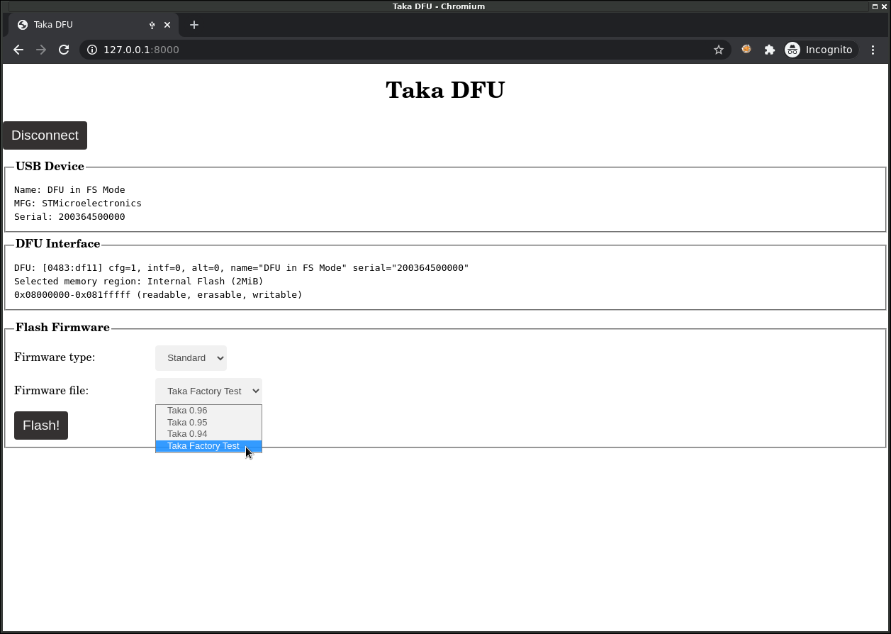
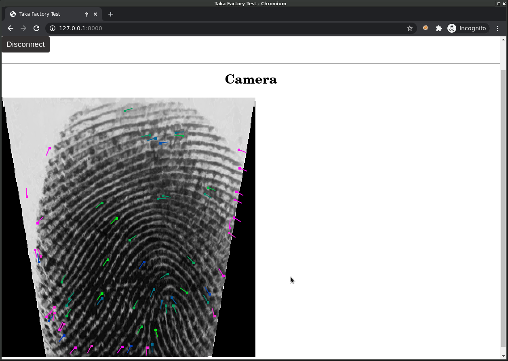

Diagnostics
===========

-----

Erreurs courantes
-----------------

Taka ne s'allume pas
^^^^^^^^^^^^^^^^^^^^

Taka ne s'allume pas ou s'éteint aussitôt.

* La batterie est déchargée, charger la batterie.
* Vérifier que le firmware est correctement programmé.
* Vérifier ou remplacer la :ref:`refCaseMotherboard`

Le doigt n'est pas détecté
^^^^^^^^^^^^^^^^^^^^^^^^^^

La présence du doigt n'est pas détectée.

* Nettoyer la vitre de la caméra optique.
* Vérifier ou remplacer le :ref:`refCaseCamera`

La date est invalide
^^^^^^^^^^^^^^^^^^^^

Lorsque la batterie est débranchée, la date et l'heure doivent être
resynchronisés via un serveur de temps (NTP). La synchronisation est
automatique lorsque le boitier Taka est connecté au réseau (internet).
(Adresse du serveur NTP: pool.ntp.org)

-----

Firmware de test
----------------

En cas d'autres dysfonctionnements de l'appareil Taka, il est possible de
passer en mode diagnostic afin de déterminer l'origine du problème et de
remplacer la pièce défectueuse le cas échéant.

Pour cela, il faut:

* **1.** Connecter Taka à un PC via un câble USB.
* **2.** Connecter Taka au réseau via un câble Ethernet.
* **3.** Programmer le firmware de test usine et redémarrer Taka.
* **4.** Suivre la procédure affichée sur l'écran et utiliser l'application de
  test depuis un navigateur web.

On commence par programmer Taka avec le firmware de test usine nommé
"Taka Factory Test", via le mode DFU et l'application WebDFU comme
expliqué dans la section :doc:`update`.

Ensuite, redémarrer le boitier Taka.

**En cas d'erreur:**

* Vérifier ou remplacer la :ref:`refCaseMotherboard`

-----

Procédure de test
-----------------

La procédure de test se déroule en étapes, chaque étape vérifiant un élément
du système. En cas de succès, le test passe à l'étape suivante. En cas d'échec,
la même étape recommence en boucle. Les instructions à suivre s'affichent
sur l'écran LCD. Certaines étapes sont automatisées, d'autres requièrent une
intervention humaine (par exemple pour vérifier que les LEDs sont bien allumées).

-----

1. Ecran LCD
^^^^^^^^^^^^

Dès le démarrage, l'écran affiche le message suivant:

**Action humaine:**

* Vérifier le bon affichage du message sur l'écran LCD
* Vérifier la présence du rétroéclairage

**En cas d'erreur:**

* Vérifier que Taka est allumé (Bouton On/Off)
* Vérifier que Taka est alimenté (Par USB)
* Vérifier ou remplacer l':ref:`refCaseScreen`

-----

2. LEDs
^^^^^^^

La LED caméra s'allume en bleu fixe et la LED située sur le dessus du boitier
change successivement de couleur (Rouge, Vert, Bleu, Jaune, Magenta, Cyan).

**Action humaine:**

* Vérifier l'allumage de la LED caméra en bleu
* Vérifier l'allumage de la LED boitier en multicolore
* Passer à l'étape suivante en touchant le capteur caméra.

**En cas d'erreur:**

* Vérifier ou remplacer le :ref:`refCaseLED`
* Vérifier ou remplacer le :ref:`refCaseCamera`

-----

3. Buzzer
^^^^^^^^^

Le buzzer émet des sons à intervalles réguliers.

**Action humaine:**

* Vérifier que le buzzer émet bien un son.
* Passer à l'étape suivante en touchant le capteur caméra.

**En cas d'erreur:**

* Vérifier ou remplacer la :ref:`refCaseMotherboard`

-----

4. Mémoire SDRAM
^^^^^^^^^^^^^^^^

**Test automatique:** validation du bon fonctionnement du composant mémoire
SDRAM présent sur la carte mère.

**En cas d'erreur:**

* Vérifier ou remplacer la :ref:`refCaseMotherboard`

-----

5. Carte SD
^^^^^^^^^^^

**Test automatique:** vérification de la présence et du bon fonctionnement
de la carte micro SD. Si nécessaire, la carte sera automatiquement formatée
avec un système de fichiers de type FAT32.

**En cas d'erreur:**

* Vérifier ou remplacer la Carte SD sur la :ref:`refCaseSD`

-----

6. Caméra
^^^^^^^^^

.. image:: _static/image/troubleshooting/camera.png
    :width: 256px

**Test automatique:** vérification de la présence et du bon fonctionnement
du capteur caméra optique.

**En cas d'erreur:**

* Vérifier ou remplacer le :ref:`refCaseCamera`

-----

7. USB
^^^^^^

Taka est en attente d'une connexion USB.

**Action humaine:**

* Connecter Taka à un PC via un câble USB.
* Utiliser l'application web dédiée aux tests, nommée "takatest",
  depuis un navigateur Web (Chrome)
* Cliquer sur "Connect".

Voir le README https://github.com/lambdaconcept/taka/tree/master/utils/takatest

.. image:: _static/image/troubleshooting/connect.png
    :width: 600px

**En cas d'erreur:**

* Vérifier ou remplacer le câble USB.
* (Sous linux): vérifier les bonnes permissions udev pour webusb.
* Vérifier ou remplacer la :ref:`refCaseMotherboard`

-----

8. Empreinte digitale
^^^^^^^^^^^^^^^^^^^^^

La caméra capture des images en boucle et les envoie au PC par l'intermédiaire
de l'API USB.

**Action humaine:**

* Placer le doigt sur le capteur.
* Vérifier dans l'interface web la bonne qualité de l'image.
* Le test passe automatiquement à l'étape suivante lorsque l'image
  est de qualité suffisante.

**En cas d'erreur:**

* Nettoyer la vitre de la caméra optique.
* Vérifier ou remplacer le :ref:`refCaseCamera`

-----

9. Carte à puce (Contact)
^^^^^^^^^^^^^^^^^^^^^^^^^

Taka est en attente de l'insertion d'une carte à puce dans son connecteur
pour initier une communication (ATR).

**Action humaine:**

* Insérer une carte d'identité.

**En cas d'erreur:**

* Vérifier le sens d'insertion (puce vers soi)
* Vérifier ou remplacer le :ref:`refCaseSmartcard`

-----

..
    10. NFC (Sans contact)
    ^^^^^^^^^^^^^^^^^^^^^^

    .. image:: _static/image/troubleshooting/nfc.png
        :width: 256px

10. Réseau
^^^^^^^^^^

Taka se connecte au réseau Ethernet et récupère une adresse IP par DHCP.

**Action humaine:**

* Connecter Taka au réseau via un câble Ethernet.

**En cas d'erreur:**

* Vérifier ou remplacer le câble Ethernet.
* Vérifier la présence d'un serveur DHCP.
* Vérifier ou remplacer la :ref:`refCaseMotherboard`

-----

11. Date/Heure
^^^^^^^^^^^^^^

**Test automatique:** configuration de la date et heure.

La synchronisation est automatique lorsque le boitier Taka est connecté au
réseau (internet). (Adresse du serveur NTP: pool.ntp.org)

**En cas d'erreur:**

* Vérifier la connexion internet.
* Vérifier ou remplacer la :ref:`refCaseMotherboard`

-----

12. Batterie
^^^^^^^^^^^^

**Test automatique:** test de charge de la batterie (par USB).

**En cas d'erreur:**

* Connecter Taka au courant via un câble USB.
* Vérifier la présence de la batterie.

-----

Succès
^^^^^^

Le test est terminé, le boitier Taka est complètement fonctionnel.
Il faut maintenant le reprogrammer avec le firmware de production, comme
expliqué dans la section :doc:`update`.
