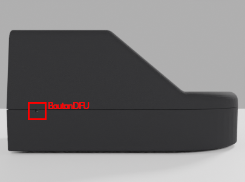
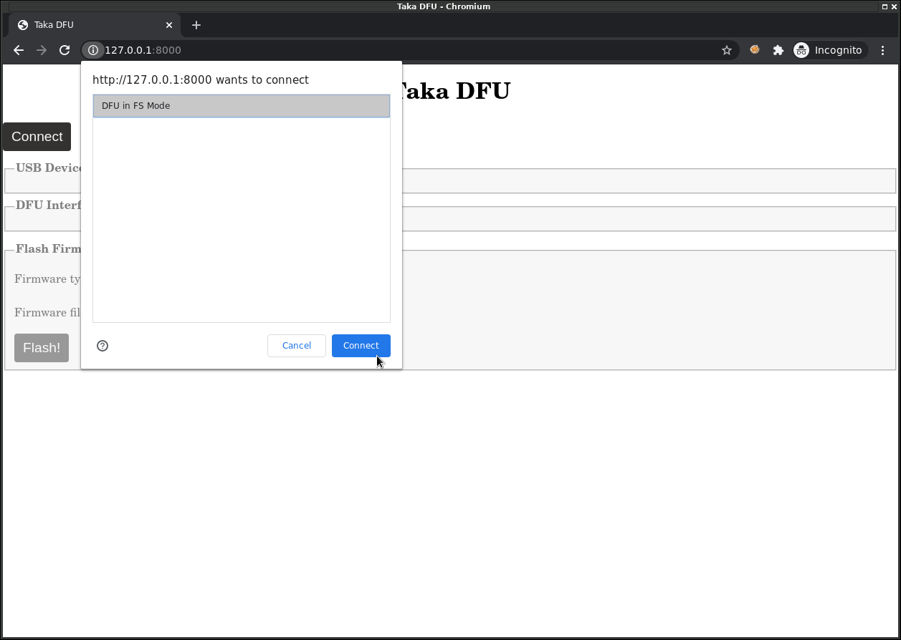
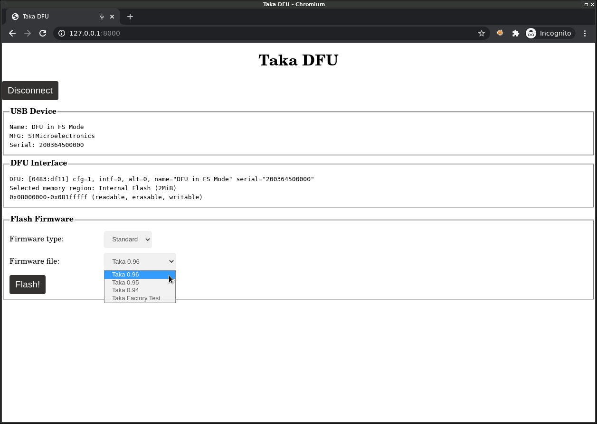
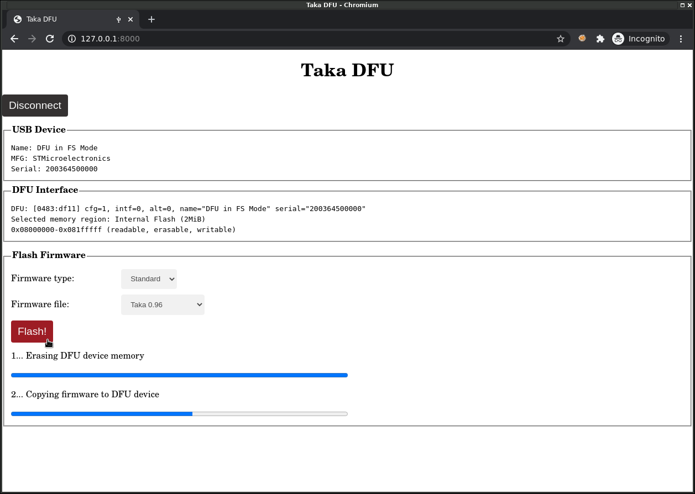

Mise à jour
===========

-----

.. _refModeDFU:

Mode DFU
--------

Le lecteur Taka peut être mis à jour via USB. Prérequis:

* **Etape 1:** Connecter Taka à un PC à l'aide d'un câble USB.
* **Etape 2:** Démarrer Taka en **mode DFU** (Device Firmware Update).

Pour cela, il faut maintenir le bouton DFU enfoncé à l'aide d'une aiguille
ou autre objet pointu, tout en démarrant Taka en actionnant l'interrupteur
On/Off.

Le bouton DFU est situé sur le coté gauche du boitier:

-----

WebDFU
------

Une application web est fournie, utilisable depuis un navigateur Web (Chrome).

Installation
^^^^^^^^^^^^

Voir le README https://github.com/lambdaconcept/taka/tree/master/utils/takadfu

::

    (Linux) Install Udev rules
    ==========================

    Write the rule in:

    /etc/udev/rules.d/45-stdfu-permissions.rules
    --------------------------------------------
    ACTION=="add", SUBSYSTEM=="usb", ATTRS{idVendor}=="0483", ATTRS{idProduct}=="df11", MODE="0664", GROUP="plugdev"
    --------------------------------------------

    Reload the rules:

    # udevadm control --reload-rules && udevadm trigger

    (Windows) Install WinUSB driver
    ===============================

    https://zadig.akeo.ie/

    Assign "WinUSB" driver to the device.

    Run the HTTP server for testing
    ===============================

    $ python3 -m http.server

    In a Web browser (Chrome), connect to:

    http://127.0.0.1:8000/

Connection
^^^^^^^^^^

Si le périphérique USB DFU n'apparait pas dans la liste, vérifiez que Taka
est bien démarré en :ref:`refModeDFU`.

Selection du firmware
^^^^^^^^^^^^^^^^^^^^^

Les firmwares précompilés sont déja inclus dans l'application web,
il suffit de sélectionner la version voulue dans la liste déroulante et
de cliquer sur le bouton "Flash!".

La mise à jour est terminée.

-----

DFU-Util
--------

.. note::
    Sous linux, il est aussi possible d'utiliser dfu-util pour faire la
    mise à jour en ligne de commande plutôt que par l'application web

::

    apt-get install dfu-util

    dfu-util -d 0483:df11 -a 0 -D taka.bin --dfuse-address 0x08000000
