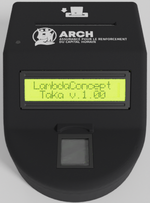
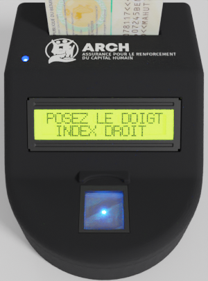
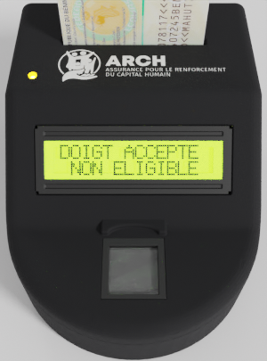
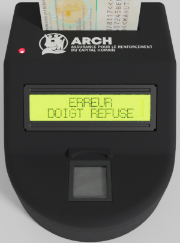

Utilisation
===========

-----

Démarrage
---------

Tout d'abord, allumer le boitier Taka en actionnant l'interrupteur On/Off
situé sur le côté droit.

Lors du démarrage, plusieurs vérifications sont effectuées pour garantir
le bon fonctionnement du système. Notamment:

* Vérification de la date/heure
* Vérification du capteur caméra
* Vérification de la présence de la carte SD

En cas d'échec des vérifications système, le message d'erreur correspondant
s'affiche sur l'écran. On se réfèrera alors à la section :doc:`troubleshooting`.

Le scénario d'authentification d'un bénéficiaire se déroule comme suit:

-----

.. _refStep1:

1. Insertion de la carte d'identité
-----------------------------------

Le boitier Taka affiche le message ``INSEREZ LA CARTE`` et attend.
Les LEDs sont éteintes.

.. image:: _static/image/usage/insert.png
    :width: 300px
    :height: 400px

Lorsque l'insertion d'une carte est détectée, la machine passe à l'étape
:ref:`refStep2`.

-----

.. _refStep2:

2. Lecture de la carte
----------------------

Affichage du message ``LECTURE EN COURS``.
Les LEDs restent éteintes.

La communication s'établit avec la carte d'identité et les actions
suivantes sont effectuées:

* Lecture des 4 conteneurs ARCH (Health, Formation, Credit, Retirement)
* Vérification des dates d'éligibilité à l'assurance maladie, en comparant
  les dates de validité spécifiées dans le conteneur ARCH "Health" avec la
  date actuelle.
* Lecture des fichiers ICAO (SoD, DG1-DG16), qui contiennent les informations
  sur l'identité de la personne.
* Authentification cryptographiques passive de la carte d'identité.

L'authentification passive (Standard ICAO 9303 Part 11) s'assure de
l'authenticité et de l'intégrité des données ICAO en validant les signatures
cryptographiques des fichiers et la chaine de confiance depuis le certificat
national PKCS#7.

Lorsque les données de la carte sont lues avec succès, passage à l'étape
:ref:`refStep3`.

En cas d'échec de la lecture (carte illisible, carte retirée, carte mal
provisionnée, carte non authentique, etc),
l'erreur correspondante est affichée sur l'écran, la LED devient rouge et
demande le retrait de la carte. Retour à l'étape :ref:`refStep1`.

-----

.. _refStep3:

3. Capture de l'empreinte digitale
----------------------------------

Affichage du message ``POSEZ LE DOIGT INDEX DROIT``.
La LED RGB devient bleue, et la LED caméra s'allume aussi en bleu pour inciter
l'utilisateur à poser son doigt. Les LED infrarouges du capteur caméra
sont activés pour assurer une meilleur qualité d'image.

L'application passe en attente jusqu'à ce que l'utilisateur pose son doigt
sur le prisme de la caméra optique. La présence du doigt est détectée par un
capteur tactile situé à l'avant du prisme.

Lorsque le doigt est stable, une image est capturée par la caméra et
traitée par une librairie d'extraction de minutiaes satisfaisant aux critères
de performance et de qualité spécifiés par MINEX.

Si la qualité de l'image est insuffisante (trop peu de minutiaes) ou que le
placement du doigt est mauvais (pas assez appuyé, trop haut, trop bas, etc),
un message est affiché sur l'écran LCD pour inviter l'utilisateur à
repositionner son doigt correctement. Le processus recommence l'étape
:ref:`refStep3`.

Si l'image est de bonne qualité, la machine passe à l'étape :ref:`refStep4`.

-----

.. _refStep4:

4. Vérification des minutiaes
-----------------------------

Les minutiaes sont convertis au format Card-Compact (ISO/IEC 19794-2:2005)
et soumis à la carte d'identité pour vérification, via l'application
MoC (Match-on-card).

Si les minutiaes soumis correspondent à ceux provisionnés, la carte accepte
l'authentification de l'utilisateur, et le boitier Taka affiche alors le
message ``DOIGT ACCEPTE`` ainsi que le statut d'éligibilité ou non à
l'assurance maladie (lu lors de l'étape :ref:`refStep2`).
Le buzzer émet un son "succès".

La couleur de la LED change en fonction des cas:

* Authentifié et éligible: LED verte

* Authentifié mais non éligible: LED jaune

En cas de refus des minutiaes par la carte, Taka affiche le message
``DOIGT REFUSE``. La LED devient rouge et le buzzer émet un son "échec".
Le nombre d'essais restants avant le blocage de la carte
est alors affiché sur l'écran.

.. image:: _static/image/usage/lockcounter.png
    :width: 300px
    :height: 400px

Dans tous les cas (authentifié ou non, éligible ou non), la tentative est
logguée. Passage à l'étape :ref:`refStep5`.

-----

.. _refStep5:

5. Journalisation des évenements
--------------------------------

L'opération d'authentification et son résultat sont enregistrés,
avec l'identité de la personne, la date et l'heure de passage, dans un
journal stocké dans une mémoire de type carte micro SD.

Ces journaux sont notamment accessibles par l'intermédiaire de l':doc:`api`.

* En cas de succès de l'authentification:
 
La procédure est terminée. Le boitier Taka passe dans un état d'attente,
jusqu'à ce que l'utilisateur retire sa carte d'identité. La procédure
recommence alors à l'étape :ref:`refStep1` pour l'utilisateur suivant.

* En cas d'échec de l'authentification:
  
La procédure retourne automatiquement l'étape :ref:`refStep3` après quelques
secondes pour un nouvel essai du même utilisateur.
